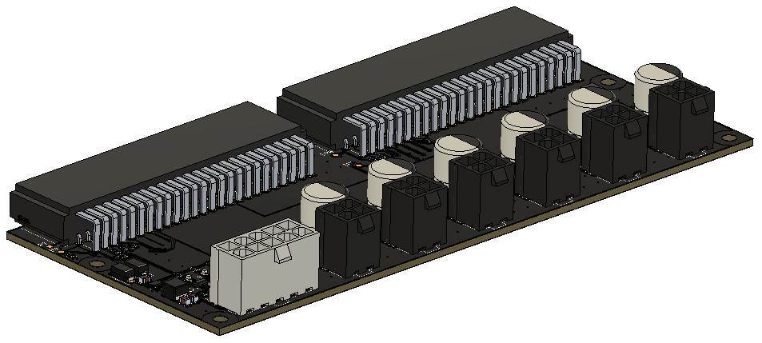
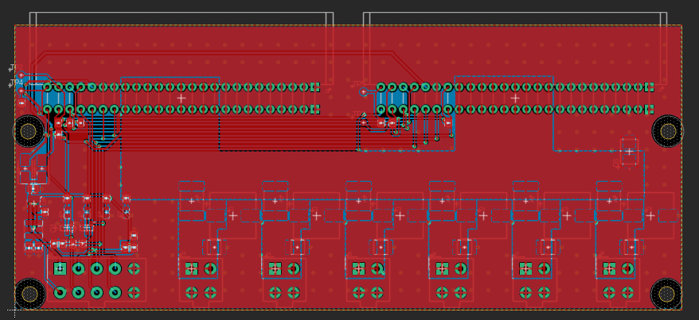
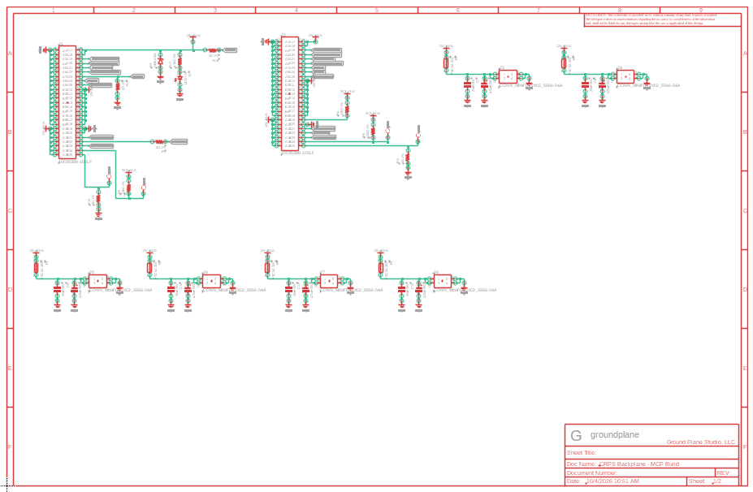
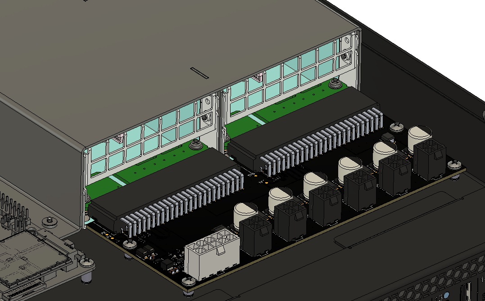
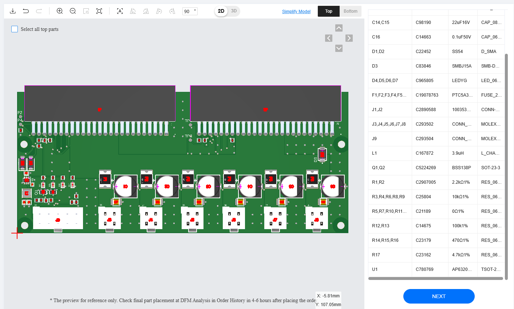

# fusion-electronics-mcp

An MCP server that lets AI agents read, review and edit PCB designs in
Autodesk Fusion Electronics: schematic capture, placement, impedance-controlled
routing, pours and stitching, design checks, and JLCPCB manufacturing outputs.

Every change is verified by reading the design back from Fusion and is undone if
the result does not match. Each tool call is one undo step in Fusion, and
nothing is saved until you ask.



*A dual CRPS power-supply backplane built in Fusion through this server: schematic drawn
as blocks from a netlist, passives placed by rule, routed with power pours kept whole,
GND stitched, silkscreen and 3D models checked.*

<table>
<tr>
<td width="50%" align="center"><br><sub>Layout</sub></td>
<td width="50%" align="center"><br><sub>Schematic</sub></td>
</tr>
<tr>
<td width="50%" align="center"><br><sub>Installed with both power supplies</sub></td>
<td width="50%" align="center"><br><sub>JLCPCB placement preview</sub></td>
</tr>
</table>

## What it can do

- **Review**: board and schematic summaries, parts, nets, DRC and ERC, a
  schematic review (unconnected power pins, boxes drawn as nets, stray wires,
  nets that need labels), and a picture of the board (`render_board`).
- **Signal integrity**: differential pairs, length matching, and impedance
  estimates (IPC-2141 closed form) against the design's real layer stackup.
- **Schematic capture**: place parts, connect pins (labels added
  automatically), rename nets or single segments, add sheets with your frame.
  Draw a whole schematic from a KiCad board as reviewable blocks: each IC or
  connector with its passives wired to it, labels only where a net leaves the
  block, rails as power symbols, with a preview before anything is drawn.
- **Placement**: move and rotate parts, import placement or netlists from a
  KiCad board, score placements and suggest moves, and place passives around
  the part they serve by rule (`place_clusters`: pull-ups and series parts on
  their pin's escape line, decaps first, bridges along the package edge, LED
  and FET chains following the part they hang off), previewed before moving.
- **Routing**, in the order a person routes a board: pours (with priority
  ranks), a GND via beside every ground pad (`ground_vias`), all the short
  pin-to-pin hops at once (`route_close`), buses laid as ordered parallel lanes
  along a path you choose (`lay_bus`), then everything left with a router that
  rips up and reroutes when blocked (`route_remaining`). Routes are 45-degree,
  keep out of connector pin fields, avoid cutting power pours, and are smoothed;
  every write is checked (connections made, no layer change without a via).
  Also single connections or nets (`route_trace`, `route_net`), impedance-
  controlled differential pairs (`route_pair`), via stitching that keeps off
  parts and other nets' pours, copying a KiCad board's routing
  (`import_routing_from_kicad`), and Fusion's autorouter.
  Routing is still in development: these tools route boards and pours today,
  step by step with you reviewing each stage, but routing a whole board on its
  own, start to finish, is not there yet.
- **Parts and libraries**: build parts from a JSON definition into a Fusion
  library (pads and pin connections verified), attach 3D models (refused if
  the body would sit upside down), update a design from its libraries
  (re-pulling parts Fusion's own update leaves on an old 3D model), push the
  board to its 3D PCB and check every part's model is on the right side.
- **Design rules and stackups**: every JLCPCB impedance stackup (16 four-layer,
  14 six-layer, built from JLC's published tables) plus a 2-layer 1.6 mm set,
  each as a .edru (rules and stackup) and a .estackup, to load in Fusion's DRC
  dialog or Layer Stack Manager (`list_design_rules`). Rules meet JLCPCB's
  published minimums, with a 0.3 mm minimum drill (smaller costs more at JLC;
  lower it in the file if you need to).
- **JLCPCB**: BOM and CPL (pick and place) files; placement orientation checked
  against the footprint JLC places each part with (still check JLC's placement
  preview before ordering, see below); a check of your gerber zip
  against the design (every layer, the outline, every drilled hole, paste and
  mask on every SMD pad).

`fusion-electronics-mcp tools` lists all 77 tools.

## Requirements

- Autodesk Fusion (desktop) with Electronics, on Windows or macOS
- Python 3.12 or newer
- An MCP client, for example Claude Code or Claude Desktop

## Install

```bash
pip install "fusion-electronics-mcp[render] @ git+https://github.com/groundplane-studio/fusion-electronics-mcp"
```

The `[render]` extra adds matplotlib for `render_board`; leave it out if you do
not need board pictures.

### Connect it to Fusion

Install the bundled add-in and run it from **Utilities > Add-Ins** in Fusion
(tick Run on Startup):

```bash
fusion-electronics-mcp install-addin
```

The add-in listens on 127.0.0.1 only, behind a per-session token.

Without the add-in, the server can fall back to **Fusion's own MCP server**
(Preferences > General > API > **Fusion MCP Server**). That works for reading
and most edits, but on current Fusion builds it does not save libraries, it
stops answering after about a minute, and it cancels Fusion's dialogs, so
saving and pushing to the 3D PCB need the add-in.

### Add it to your MCP client

Claude Code:

```bash
claude mcp add fusion-electronics -- fusion-electronics-mcp
```

Claude Desktop (`claude_desktop_config.json`; use the full path to the command
if it is not on your PATH):

```json
{
  "mcpServers": {
    "fusion-electronics": { "command": "fusion-electronics-mcp" }
  }
}
```

### Check the setup

With Fusion running:

```bash
fusion-electronics-mcp doctor
```

## Libraries

### Groundplane's libraries (optional)

[groundplane-studio/fusion-libraries](https://github.com/groundplane-studio/fusion-libraries)
has the libraries we design with: passives with a variant per value and its JLCPCB
part number, schematic frames and power symbols, and our active parts and
connectors. Upload the `.flbr` files to a Fusion project (Data Panel > Upload) and
add them to a design from the Library Manager. Then point the server's schematic
tools at the frames and power symbols:

```
FUSION_MCP_SHEET_FRAME=FRAME_B_L@!GPLIB_SCHEMATIC
FUSION_MCP_GROUND_SYMBOL=GND_EARTH@!GPLIB_SCHEMATIC
FUSION_MCP_POWER_SYMBOL=12V@!GPLIB_SCHEMATIC
```

Any library works: these settings only name the devices to use.

### Your own parts library

For parts no library has, the server keeps part definitions (JSON files) in its
component library folder and builds them into a Fusion library of yours:

1. In Fusion, create an empty electronics library in your project (for example
   "MCP Library") and save it.
2. Get the part's footprint as a KiCad `.kicad_mod`: from KiCad's libraries, or
   JLCPCB's own footprint and 3D model with
   [easyeda2kicad](https://github.com/uPesy/easyeda2kicad.py)
   (`easyeda2kicad --full --lcsc_id=C2040`; a separate program, AGPL-3.0).
   Fetch one part at a time with a pause between parts: EasyEDA refuses bursts
   (HTTP 403), so if it does, wait a while and try again.
3. Ask your agent to create the part (`create_library_part`: footprint, name,
   value, JLCPCB number, pin names). Two-pin passives get the same symbols as
   the rest of your schematic; other parts get a box with named pins.
4. Open your library in Fusion and have the agent run `insert_library_part`,
   `save_design`, then `attach_3d_model` with the part's STEP file. A model
   that would sit upside down is refused.
5. Close the library (`close_library`) and place the part with `add_part`.

Part definitions live in `%LOCALAPPDATA%\fusion-electronics-mcp\library\parts`
on Windows (`FUSION_MCP_LIBRARY` to change), so you can keep them in git.

## Using it

Open a design in Fusion, then ask your agent things like:

- "Review the schematic and list anything that looks wrong."
- "Check the impedance and length matching of the USB and Ethernet pairs."
- "Route USB_DP/USB_DN as a 90 ohm pair from J2 to J4, matched to 0.1 mm."
- "Add a GND pour on both inner layers and stitch it, keeping vias 0.6 mm from the pairs."
- "Export the JLCPCB BOM and CPL, and check the gerber zip in my Downloads."

Gerbers: Fusion's CAM cannot be driven from outside, so export the gerber zip
from Fusion's CAM Processor yourself; `check_gerbers` then checks it against the
design before you upload it.

### Before you order from JLCPCB

`check_jlc_orientation` compares each part's footprint with the one JLCPCB places
it with and writes the rotation and offset corrections into the CPL. Parts it cannot
match with confidence (pads that are named differently, polarity it cannot tell)
are listed under `needs_review` rather than guessed. It is a check, not a
guarantee: footprints JLCPCB has never published, or has changed, are not covered.

So before you pay for assembly, open JLCPCB's component placement preview on the
order page and look at every part: pin 1 and polarity marks (diodes, LEDs,
electrolytics, ICs, connectors) must line up with the board's markings, and
every part must sit on its pads. Rotate any that do not right there, then put the
same correction on the part in your library (`JLC-ROTATION`, `JLC-X-OFFSET`,
`JLC-Y-OFFSET`) so the next order comes out right.

## Safety and privacy

- **No telemetry.** The server talks to Fusion on 127.0.0.1 only.
- **The add-in only does design edits.** It listens on 127.0.0.1 only, answers
  only requests carrying the per-session token it writes to your user folder,
  and runs only Fusion design commands from a fixed list (no `RUN`, `SCRIPT`,
  `SYSTEM`, file or export commands), so an agent cannot use it to run programs
  or reach files outside the design.
- **One exception, on request**: `check_jlc_orientation` with `fetch=true`
  downloads footprints from easyeda.com (cached forever, at least 15 s between
  requests). Nothing else leaves your machine. The service tools
  (`request_design_review`, `get_assembly_quote`) are stubs and make no network
  calls.
- **Fusion's questions get safe answers.** Fusion asks things with pop-up
  dialogs; a watchdog answers the ones a tool expects and cancels the rest
  (Cancel / No, never Yes). Windows only so far: on macOS a dialog waits for you.
- **Your keyboard stays yours.** If Fusion grabs focus while a tool runs, focus
  goes back to the window you were typing in (`FUSION_MCP_KEEP_FOCUS=0` turns
  this off).
- When you are in the middle of a command in Fusion, edits wait for you
  (Fusion refuses them) instead of cancelling your command.

## Configuration

| Variable | Default | Purpose |
|---|---|---|
| `FUSION_MCP_TRANSPORT` | `auto` | `addin`, `builtin` (Fusion's MCP server), or `auto` (the add-in when it is running, else the built-in server) |
| `FUSION_MCP_BUILTIN_URL` | `http://127.0.0.1:27182/mcp` | Fusion's MCP server address |
| `FUSION_MCP_LIBRARY` | per-user data folder | component library (part JSON files) |
| `FUSION_MCP_SHEET_FRAME` | none | frame for new schematic sheets, `DEVICE@LIBRARY` |
| `FUSION_MCP_GROUND_SYMBOL` | none | ground symbol for block schematics, `DEVICE@LIBRARY` |
| `FUSION_MCP_POWER_SYMBOL` | none | power symbol for block schematics (its value is set to each rail's name), `DEVICE@LIBRARY` |
| `FUSION_MCP_KEEP_FOCUS` | `1` | hand keyboard focus back when Fusion takes it |
| `FUSION_MCP_EASYEDA_CACHE` | per-user data folder | EasyEDA footprint cache |
| `FUSION_MCP_EASYEDA_INTERVAL_S` | `15` | minimum seconds between EasyEDA requests |

The per-user data folder is `%LOCALAPPDATA%\fusion-electronics-mcp` on Windows
and `~/Library/Application Support/fusion-electronics-mcp` on macOS.

## Known limits

- Routing is still in development. Boards and pours can be routed with the
  tools above, one stage at a time, but fully automatic routing of a whole board
  is still being worked on: expect to guide it and review each stage.
- Gerbers are exported from Fusion's CAM dialog by hand (checked by the tool).
- Impedance figures are closed-form estimates, typically within about 10%;
  confirm critical pairs with your fab's calculator.
- The dialog watchdog and focus guard are Windows-only so far.
- Built and tested against Fusion 2705.1.15. Fusion's undocumented command
  interface can change between releases; `docs/architecture.md` lists the
  behaviours the tools depend on.

## Development

```bash
git clone https://github.com/groundplane-studio/fusion-electronics-mcp
cd fusion-electronics-mcp
pip install -e ".[render]"
python -m unittest discover -s tests
```

`docs/architecture.md` explains how the server, Fusion and the add-in fit
together. `tests/live/` holds scripts that drive a running Fusion.

## License

MIT. See `LICENSE`.
